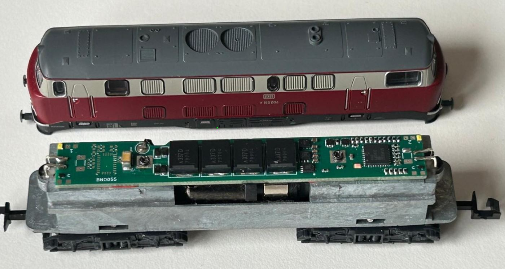

# RTB_D15

My Homebrew [D15](https://rtb4dcc.de/hardware/decoder/d15/) decoder is a drop in replacement for the original analog Minitrix (#7230) PCB. The decoder is designed to integrate into the [RTB](https://rtb4dcc.de/concept/) digital control infrastructure.

See also

- [RTB_D12 - custom](https://github.com/git4dcc/RTB_D12) (Fleischmann V100)
- [RTB_D13 - custom](https://github.com/git4dcc/RTB_D13) (Minitrix coach)
- [RTB_D16 - NEM651](https://github.com/git4dcc/RTB_D16)
- [RTB_D20 - NEM651](https://github.com/git4dcc/RTB_D20)
- [RTB_D21 - Next18](https://github.com/git4dcc/RTB_D21)
- [RTB_D22 - Plux16](https://github.com/git4dcc/RTB_D22)
- [RTB_D23 - NEM652](https://github.com/git4dcc/RTB_D23)

User Guides

- User Guide - DE
- [User Guide - EN](https://rtb4dcc.de/rtb_decoder_reference_en/)

 

## Decoder features
- **Minitirx V160** PCB decoder
- **DCC**
  - DCC-A automatic logon
  - DCC-R protocol extension
  - Service Mode Programming
- **Railcom**
  - Channel 1/2
  - POM, xPOM
  - DYN: Speed, QoS, Track-voltage, Motor-current, AUX-current, Temp, Distance travelled
- 7-18V track voltage
- heartbeat LED
- adjustable max motor current (default 250mA)
- adjustable max AUX current (default 250mA)
- over temp protection
- Function output: LF/LR (dimmable, 1.4kHz), LED on PCB
- Function output: AUX1/AUX2 (dimmable, 1.4kHz) for driver cabin (LEDs on PCB)
- Function output: AUX3/AUX4 logic level
- Function output: AUX5/AUX6 open drain (each 250mA)
- buffer capacitor 4x330uF
- optional 9-axis orientation sensor
- <10mA idle power consumption
- Firmware update over main tracks via DCC-R protocol

# Hardware
The current PCB layout uses SMD footprints with 0.5mm pitch and mainly 0402 parts. Reflow soldering is mandatory whereas handsoldering almost impossible.

## PCB
- 4-layer PCB, FR4, 0.8mm
- CPU: AVR64DA32
- Motor bridge: DRV8231
- Inrush limiter: TPS22810
- 9-axis absolute-orientation sensor: BNO055

## Kicad
[Schematic](doc/D12_schematic.pdf) | [Layout](doc/D12_layout.pdf) | [Gerber](gerber)

Dependency

 

:yellow_circle: Requires my Kicad project library [RTB_SamacSys](https://github.com/git4dcc/RTB_SamacSys) in the same directory tree.

## Firmware
Filename structure: { **pcb** }{ **code** }{ **version** }.hex

Example: **D15F0001**.hex

|   | Description |
| --- | --- |
| **pcb** | Name of matching hardware (**D12**) |
| **code** | Type of code contained (**R**=rom, **B**=bootloader, **F**=flash, **U**=bld update, **P**=UPDI factory code) |
| **version** | Release version (**####**) |

[Firmware files](firmware)

# Images
 

# YouTube
See the D15 decoder in action.  

This project is intended for hobby use only and is distributed in accordance with the Apache License 2.0 agreement.
